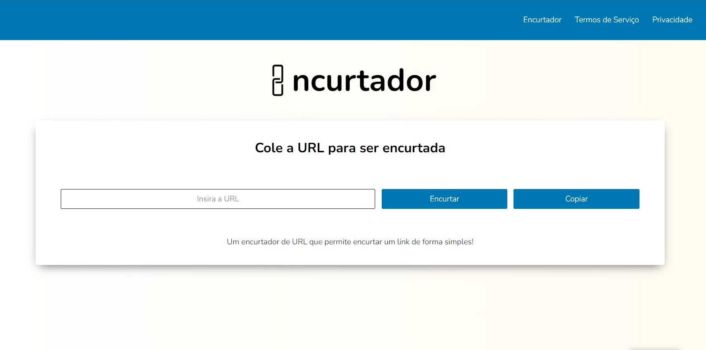

# Encurtador de URL

Um encurtador de URL simples utilizando HTML, CSS e JavaScript!

## Preview

## Visão Geral

Este é um encurtador de URL que permite aos usuários encurtar URLs longas em versões mais curtas e fáceis de compartilhar. O objetivo principal do aplicativo é fornecer uma maneira rápida e conveniente de reduzir o tamanho das URLs para facilitar o compartilhamento em plataformas como redes sociais, e-mails ou mensagens.

## Recursos

- Encurta URLs longas para versões mais curtas e gerenciáveis.
- Redireciona automaticamente os usuários para a URL original ao clicar no link encurtado.
- Interface simples e intuitiva para facilitar o uso.

## Como Usar

1. Acesse a página do aplicativo [aqui](https://dev-paixao.github.io/encurtador-url/).
2. Na caixa de texto "Insira a URL para encurtar", digite ou cole a URL que você deseja encurtar.
3. Clique no botão "Encurtar" para gerar a versão encurtada da URL.
4. O link encurtado será exibido abaixo e estará pronto para ser copiado e compartilhado.

## Personalização

Este encurtador de URL pode ser facilmente personalizado para atender às suas necessidades específicas. Você pode ajustar o design, as cores e os elementos da interface usando HTML e CSS. Além disso, se você deseja adicionar recursos adicionais, como estatísticas de cliques ou armazenamento de URLs encurtadas, você pode expandir o código JavaScript fornecido.

## Contribuição

Contribuições são bem-vindas! Se você deseja contribuir para este projeto, siga as etapas abaixo:

1. Faça um fork deste repositório.
2. Crie uma nova branch com a sua feature: `git checkout -b minha-feature`
3. Faça as alterações desejadas e salve-as.
4. Commit suas alterações: `git commit -m 'Adicionando minha feature'`
5. Faça push para a branch: `git push origin minha-feature`
6. Envie um pull request.

## Licença

Este projeto está licenciado sob a licença [MIT](LICENSE).
